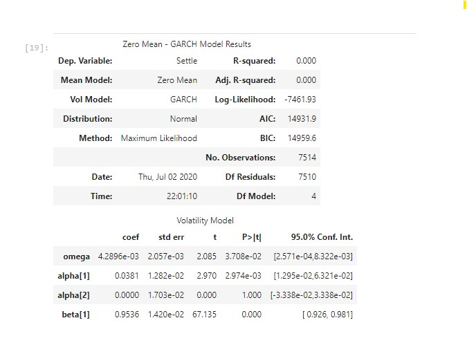

## Time series Forecasting
1. Based on your time series analysis, would you buy the yen now?

Answer -Looking at the below graph during the observation period Yen has continuosly strengthen over a period but with but with constant volatility, therefore it can be a good an inverstor can gain profit when the presepective of investemnet is short term as compare to long term.

2. Is the risk of the yen expected to increase or decrease?

Answer -

According to the GARCH model  when beta is not bigger than 1 then its a good indication becaouse  when it is bigger than1, a small shock will grow and get louder and louder over time. So in terms of volatility of our model we want beta to be less than 1 in absolute value.

 Omeag is the baseline variance for the model. It sayas the variance would be if information about past variances were not being passed to the model. So the square-root of omega would be the standard deviation in returns. Finally, the alpha term tells us how much the previous period’s volatility to add to today’s volatility.Looking at both omega and alpha coefficients along with Beta we can predict the less volatility hence less risk of the yen.

 

 
 

3. Based on the model evaluation, would you feel confident in using these models for trading?

Answer- I will be confident in using these models for short term  investment. For long term the model should consider other econoomic factors which drives the exchnage rate.

## Linear Regression Forecasting

Does this model perform better or worse on out-of-sample data compared to in-sample data?

Answer-
Test Data - Out-of-Sample Root Mean Squared Error (RMSE): 0.4151933603075715
Train Data - In-sample Root Mean Squared Error (RMSE): 0.5657562717010388

RMSE of test data < RMSE of train data , this indicate the underfitting of data, if the model would have performed well then the RMSE of train dataset would have been quite closer to test dataset.